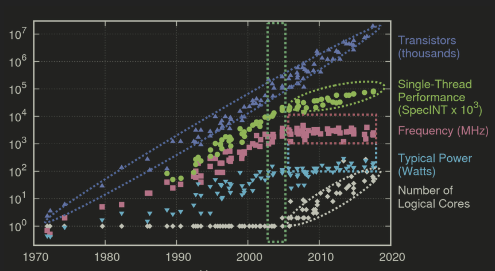

https://en.algorithmica.org/hpc/complexity/hardware/

`Dennard scaling` giảm kích thước bóng bán dẫn 30% sẽ giúp:
* tăng gấp đôi mật độ bóng bán dẫn (0.7^2 ≈ 0.5),
* tăng tốc độ thêm 40% (1/0.7 ≈ 1.4),
và giữ nguyên mật độ năng lượng tổng thể.

`Moore Law` Gordon Moore đưa ra dự đoán từ 1975 rằng số lượng bóng bán dẫn trong bộ vi xử lý sẽ tăng gấp đôi hai năm một lần và vẫn còn đúng cho tới ngày nay.

Những năm 2000 do ko giảm được kích thước bóng bán dẫn nữa nên các nhà sản xuất bắt đầu nhồi nhiều bóng bán dẫn hơn và làm cho bộ vi xử lý ngày càng phức tạp hơn. Số lượng lõi của tăng tỷ lệ thuận với số lượng bóng bán dẫn. Ngày nay số lõi đã tăng đến hàng trăm.




https://en.algorithmica.org/hpc/complexity/languages/

Bài học rút ra là sử dụng ngôn ngữ bậc thấp không mang phải bao giờ cũng mang lại hiệu năng; nhưng nó mang lại sự kiểm soát về hiệu năng (nhiều lựa chọn hơn các ngôn ngữ bậc cao). Sau cùng, lập trình viên là người chịu trách nhiệm cho việc tận dụng mọi cơ hội mà phần cứng mang lại.


https://en.algorithmica.org/hpc/architecture/

Khi bắt đầu tự học tối ưu hoá chương trình, một sai lầm thường gặp là chủ yếu dựa trên thực nghiệm (thử sai) mà ko hiểu máy tính thực sự hoạt động ntn. Tác giả đã mò mẫm swap nested loops, rearrange arithmetic, combine branch conditions, inline functions bằng tay, và làm theo các mẹo tối ưu nghe được từ người khác, hy vọng mù quáng sẽ cải thiện được hiệu năng.

Tác giả có lẽ đã tiết kiệm được rất nhiều thời gian và công sức nếu học kiến trúc máy tính trước khi cài đặt thuật toán. Vậy nên dù ko có nhiều người hứng thú với chủ đề này, chúng ta vẫn dành vài chương để tìm hiểu cách CPUs hoạt động và lập trình Assembly.


https://en.algorithmica.org/hpc/architecture/isa/

An abstraction of a CPU is called an instruction set architecture (ISA), and it defines how a computer should work from a programmer’s perspective. Similar to software interfaces, it gives computer engineers the ability to improve on existing CPU designs while also giving its users — us, programmers — the confidence that things that worked before won’t break on newer chips.

Developing and maintaining a completely separate ISA is costly, so mainstream CPU designs ended up converging to one of the two families: `RISC vs CISC`.

The main difference between them is that of architectural complexity, which is more of a design philosophy rather than some strictly defined property:

* Arm CPUs are reduced instruction set computers (RISC). They improve performance by keeping the instruction set `small and highly optimized`, although some less common operations have to be implemented with subroutines involving several instructions.

* x86 CPUs are complex instruction set computers (CISC). They `improve performance by adding many specialized instructions`, some of which may only be rarely used in practical programs.

The main advantage of RISC designs is that they result in simpler and smaller chips, which projects to lower manufacturing costs and power usage. It’s not surprising that the market segmented itself with Arm dominating battery-powered, general-purpose devices, and leaving the complex neural network and Galois field calculations to server-grade, highly-specialized x86s.

```
Modern 64-bit versions of x86 are known as “AMD64,” “Intel 64,” or by the more vendor-neutral names of “x86-64” or just “x64.” A similar 64-bit extension of Arm is called “AArch64” or “ARM64.” In this book, we will just use plain “x86” and “Arm” implying the 64-bit versions. ↩︎
```


https://en.algorithmica.org/hpc/architecture/assembly/

`*c = *a + *b`

```arm
; *a = x0, *b = x1, *c = x2
ldr w0, [x0]    ; load 4 bytes from wherever x0 points into w0
ldr w1, [x1]    ; load 4 bytes from wherever x1 points into w1
add w0, w0, w1  ; add w0 with w1 and save the result to w0
str w0, [x2]    ; write contents of w0 to wherever x2 points
```

```x86
; *a = rsi, *b = rdi, *c = rdx
mov eax, DWORD PTR [rsi]  ; load 4 bytes from wherever rsi points into eax
add eax, DWORD PTR [rdi]  ; add whatever is stored at rdi to eax
mov DWORD PTR [rdx], eax  ; write contents of eax to wherever rdx points
```