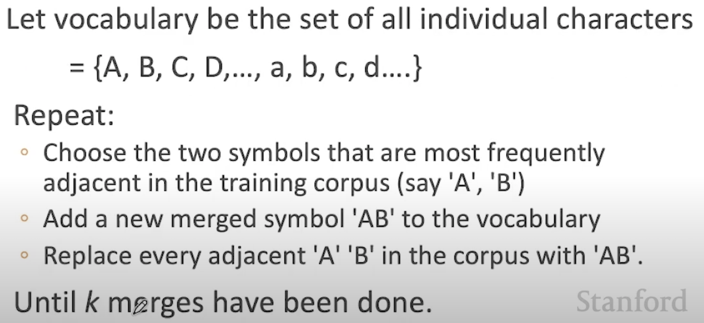

Lecture video https://youtu.be/tOMjTCO0htA?t=69

Mỗi lần symbol mới dc tạo ra cần scan toàn bộ mảng vocabs để đánh dấu symbol mới tạo thành và hình thành các symbol tiềm năng mới.

=> Có lẽ cần 1 thuật toán tìm sub-string hiệu quả để đánh dấu symbol mới hợp thành!

- - -

### Thuật toán tìm sub-string hiệu quả

http://0x80.pl/articles/simd-strfind.html#algorithm

Basically these algorithms could be split into two major categories: (1) based on Deterministic Finite Automaton, like Knuth-Morris-Pratt, Boyer Moore, etc., and (2) based on a simple comparison, like the Karp-Rabin algorithm.

> The main problem with these standard algorithms is a silent assumption that comparing (only happened on) a pair of characters, and looking up in an extra table and conditions are cheap, while comparing two substrings is expansive.

But current desktop CPUs do not meet this assumption, in particular:

* There is no difference in comparing one, two, four or 8 bytes on a 64-bit CPU. When a processor supports SIMD instructions, then comparing vectors (it means 16, 32 or even 64 bytes) is as cheap as comparing a single byte.

* Thus comparing short sequences of chars can be faster than fancy algorithms which avoids such comparison.

* Looking up in a table costs one memory fetch, so at least a L1 cache round (`~3` cycles). Reading char-by-char also cost as much cycles.

* Mispredicted jumps cost several cycles of penalty (`~10-20` cycles).

* There is a short chain of dependencies: read char, compare it, conditionally jump, which make hard to utilize out-of-order execution capabilities present in a CPU.

https://github.com/ashvardanian/CppBenchSubstrSearch

https://github.com/cloudflare/sliceslice-rs (based on 0x80.pl/articles/simd-strfind)