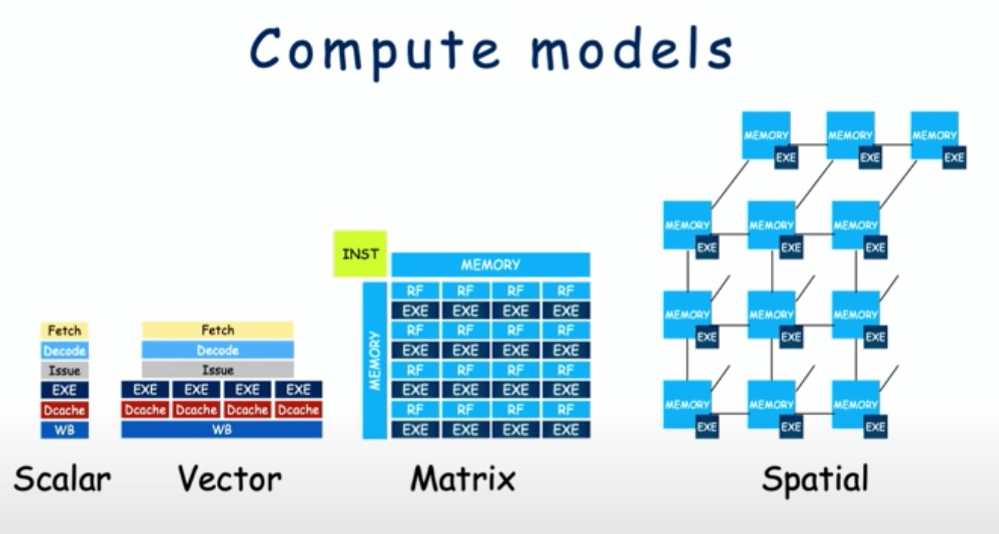
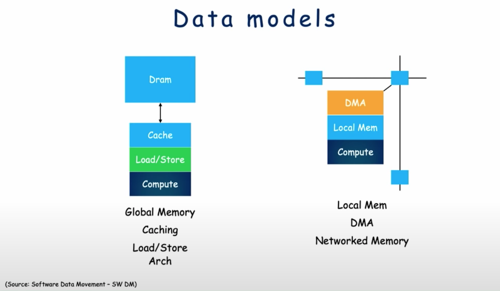

Note: nhặt ngẫu nhiên từ nhiều nguồn

### Ascalon RiscV Processor
https://youtu.be/KOHQQyAKY14?t=506

RV64ACDFMV
* 64 bit
* Atomic Instructions
* Compressed (16 bit instructions)
* Double-presision FP (floating point)
* Single-presision FP (F for float)
* Integer Multiplication
* Vector

U Architecture
* Branch predictors
* 64K L1l with 32-byte fetch per cycle (L1 cache)
* 6-wide issue

### Computing models
https://youtu.be/8eT1jaHmlx8?t=800

Spatial kiểu như PIM (processing in memory) => đưa việc tính toán tới gần với nơi lưu trữ dữ liệu

Mô hình truyền thống (Global Memory Access) bên trái cực kỳ ổn định.

Bên phải là tính toán tại bộ nhớ cục bộ với dữ liệu ở khắp mọi nơi (networked memory) và phải kiểm soát việc dịch chuyển dữ liệu tới compute node hoặc dịch chuyển dữ liệu đã tính toán xong đi chỗ khác. 

=> Kiểm soát việc dịch chuyển dữ liệu là rất khó!
