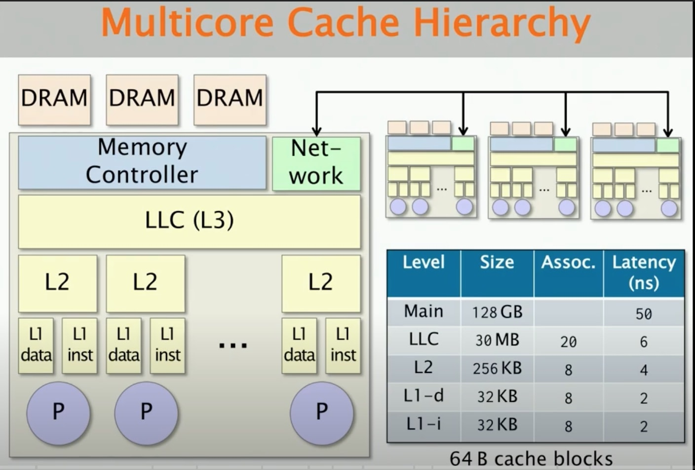
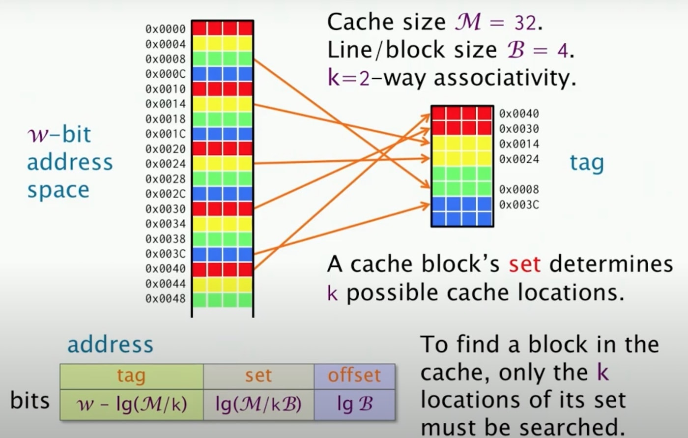
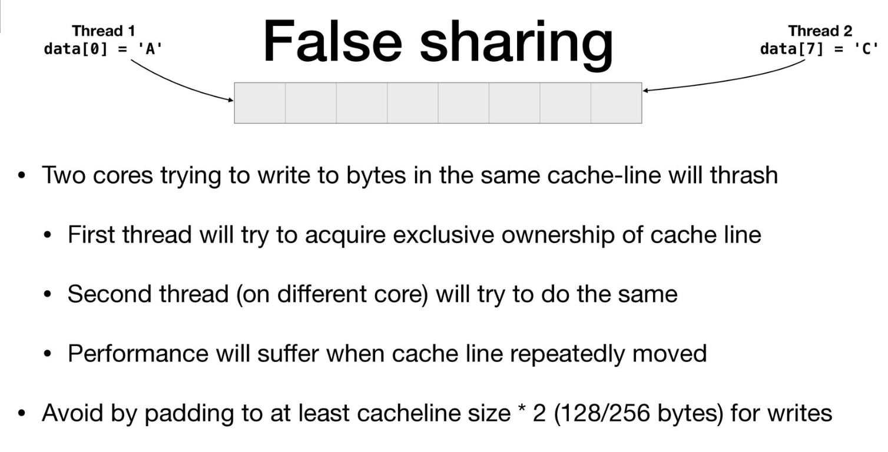
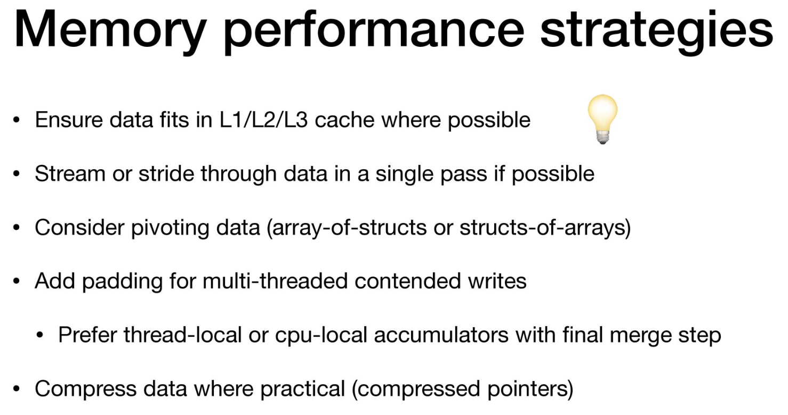
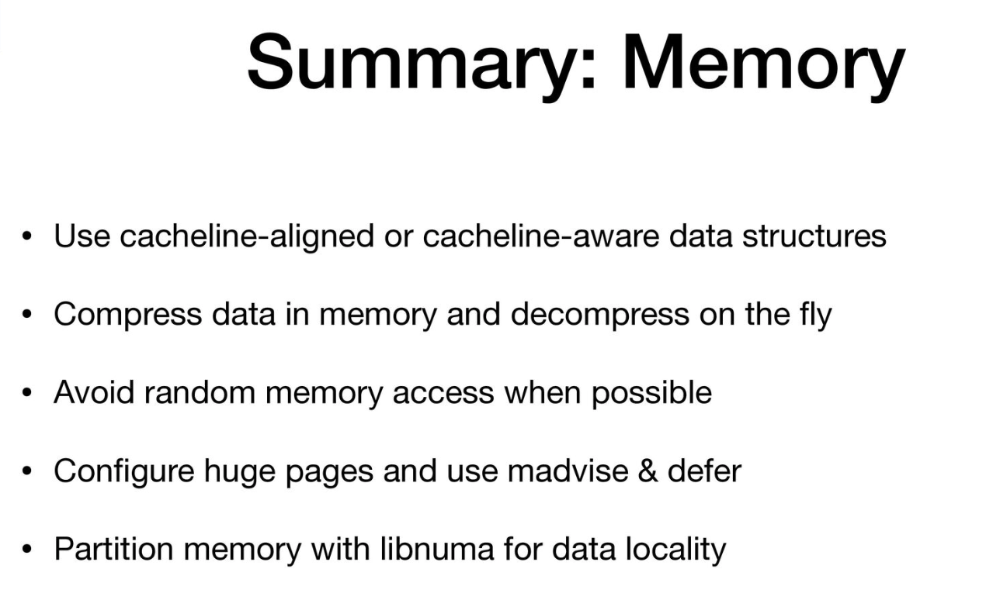

## Cache

Dữ liệu được đọc và ghi theo từng mẻ, 64/128-bytes, gọi là cache-line.
Khi ghi dù chỉ 1 bit, bạn đang ghi 64/128-bytes.

Khi 2 processes cùng yêu cầu sử dụng 1 cache-line thì xảy ra conflict cache miss.
=> Cần thận khi dùng chung dữ liệu, ngoài racing condition thì còn gây cache miss.

L1i for instructions
L1d for data

https://youtu.be/xDKnMXtZKq8?list=PLUl4u3cNGP63VIBQVWguXxZZi0566y7Wf&t=92

64B cache blocks => 64 byte cache line

## Cache-line
https://youtu.be/Pa_l3aHCoGc?t=1391

Dữ liệu được đọc và ghi theo từng mẻ, 64/128-bytes, gọi là cache-line.
Khi ghi dù chỉ 1 bit, bạn đang ghi 64/128-bytes

### Prefetching (CPU)
CPU tự động prefect dữ liệu. Sử dụng `__builtin_prefetch` để gợi ý (cần đo lường hiệu quả)

To fix a false sharing problem you need to make sure that the data accessed by the different threads is allocated to different cache lines.

